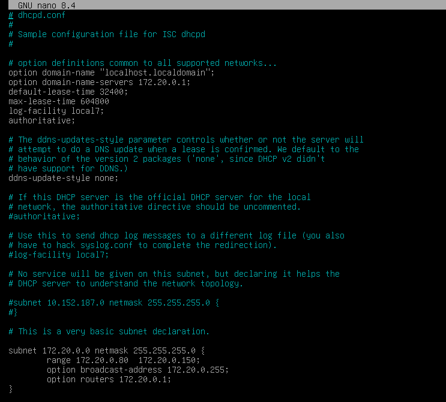
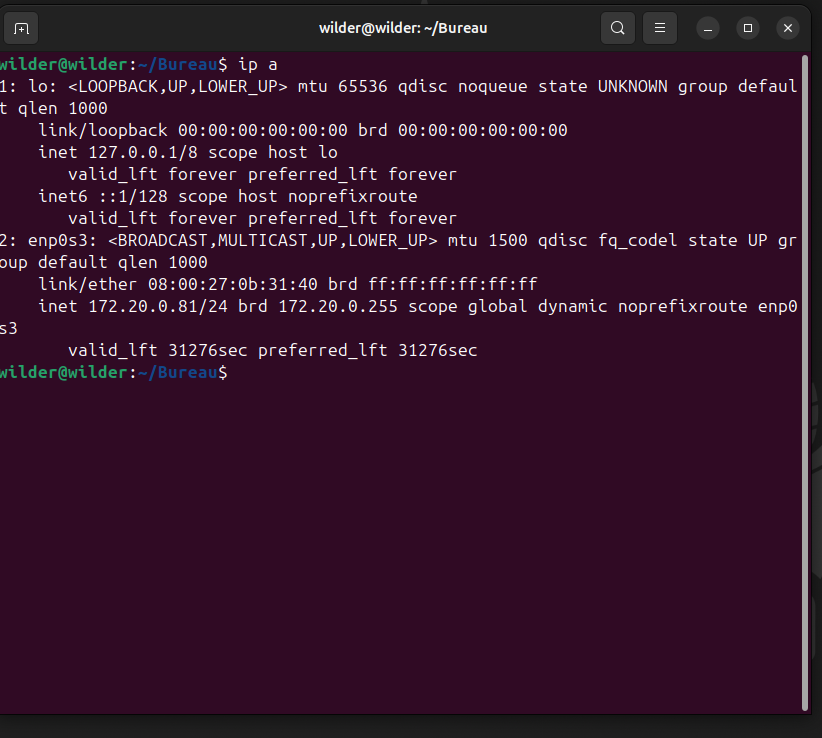
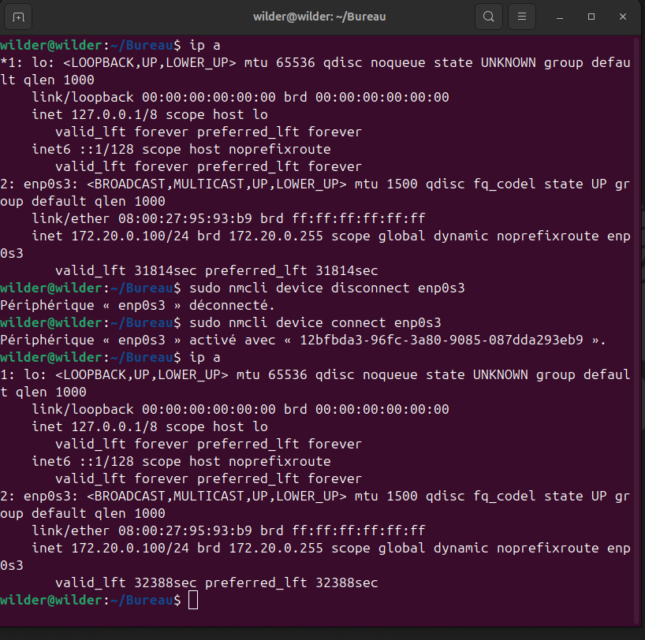

# DHCPLinuxDebian
Atelier DHCP avec Linux Debian

Le serveur DHCP possède un nom d'hôte adapté à son rôle ainsi qu'une configuration IP correcte

La configuration du serveur permet bien aux client d'obtenir une adresse IP par le serveur DHCP dans la plage d'adresse donnée

Le client qui possède la réservation n'obtient pas une autre IPv4, même s'il demande un renouvellement

